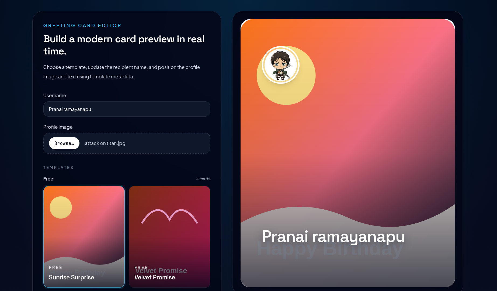
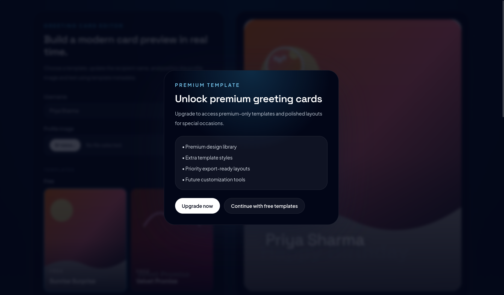
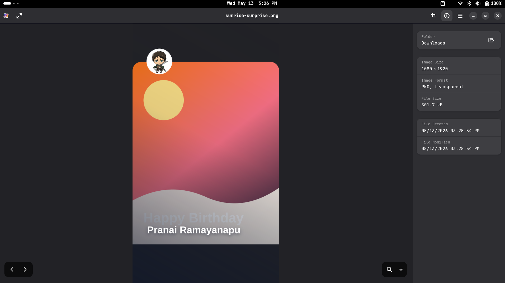

# Greeting Card Personalization App

A modern greeting card personalization app built with Next.js, Tailwind CSS, and Firebase. The project includes a live editor, PNG export, image sharing support, premium template gating, Firebase Authentication, and Firestore user storage.

## Problem-Solving Approach

The image overlay logic is built around a fixed export canvas and percentage-based template metadata. Each template stores `textPosition` and `profilePosition` values in `data/editorTemplates.json`, and those values are converted into pixel coordinates inside `lib/cardExport.js`.

The export pipeline works in this order:

1. Load the selected template image and the user's profile image.
2. Draw the template onto a fixed 1080x1920 canvas.
3. Add a gradient overlay to keep text readable.
4. Place the circular profile image using the template's profile coordinates.
5. Draw the username using the template's text coordinates.
6. Return the canvas as a PNG for download or sharing.

This approach keeps the live editor preview and the exported image aligned while avoiding layout issues from browser-only DOM capture.

## Features

- Greeting card editor with live preview
- Template-specific overlay positioning with absolute elements
- Background template image, profile image overlay, and username overlay
- PNG export using a fixed-size canvas compositor
- Native share sheet support for WhatsApp, Instagram, Email, and other apps when supported by the device/browser
- Premium subscription popup UI for gated templates
- Firebase Authentication for Google, email/password, and guest login
- Firestore storage for user profile data
- Responsive Tailwind CSS UI
- Modern light and dark friendly styling

The Share button uses the browser's native share sheet on supported devices so users can send the generated image to apps like WhatsApp, Instagram, Email, and more.

## Tech Stack

- Next.js 14 App Router for the UI and routing
- React 18 for component logic and state
- Tailwind CSS for styling
- Firebase Authentication for Google, email/password, and guest login
- Firestore for user profile storage
- HTML2Canvas in the dependency tree, though the export flow now relies on the Canvas API
- Canvas API for PNG generation and compositing
- Native Web Share API for device share sheets when supported

## Setup Instructions

1. Install dependencies.
2. Create a `.env.local` file in the project root.
3. Add the Firebase environment variables below.
4. Run `npm run dev`.
5. Open the app and visit `/login`, `/signup`, `/home`, or `/editor`.

## Firebase Setup

Enable these Firebase Authentication providers in the Firebase Console:

- Google
- Email/Password
- Anonymous

Add the following variables to `.env.local`:

```env
NEXT_PUBLIC_FIREBASE_API_KEY=your-api-key
NEXT_PUBLIC_FIREBASE_AUTH_DOMAIN=your-project.firebaseapp.com
NEXT_PUBLIC_FIREBASE_PROJECT_ID=your-project-id
NEXT_PUBLIC_FIREBASE_STORAGE_BUCKET=your-project.appspot.com
NEXT_PUBLIC_FIREBASE_MESSAGING_SENDER_ID=your-sender-id
NEXT_PUBLIC_FIREBASE_APP_ID=your-app-id
```

User documents in Firestore store:

- `displayName`
- `email`
- `profilePhoto`
- `loginType`

## Folder Structure

```text
app/
components/
data/
lib/
public/templates/
styles/
```

Key files:

- [app/editor/page.js](app/editor/page.js)
- [app/home/page.js](app/home/page.js)
- [components/PremiumModal.js](components/PremiumModal.js)
- [lib/cardExport.js](lib/cardExport.js)
- [lib/firebase.js](lib/firebase.js)
- [public/templates/templates.json](public/templates/templates.json)

## Screenshots

Add screenshots for these views:

- Greeting card editor preview

- Premium subscription popup

- PNG export state


## Future Improvements

- Drag-and-drop card element positioning
- Save personalized cards to Firestore
- More template collections and seasonal themes
- Font and color customization controls
- Real subscription checkout integration
- Multi-line text fitting and automatic text wrapping for longer names
- Template editor tooling for authoring and validating new overlay metadata

## Challenges Faced

- Keeping the editor beginner-friendly while still supporting reusable helpers
- Handling browser-only PNG export cleanly with a canvas compositor
- Keeping overlay coordinates consistent between the live preview and the exported PNG
- Fixing cropped overlay text by matching the export canvas to the template metadata and canvas bounds
- Providing graceful fallback paths when the Web Share API is unavailable
- Preserving a responsive layout while using absolute-position overlays
